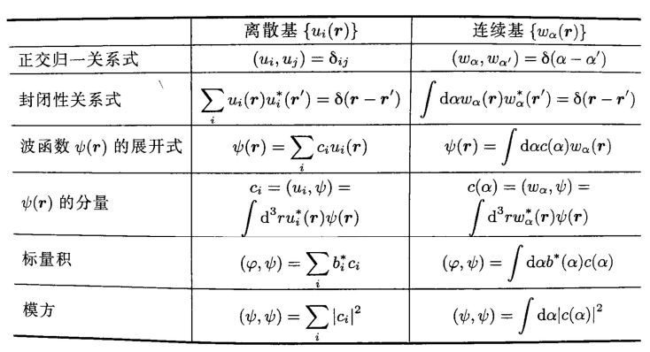
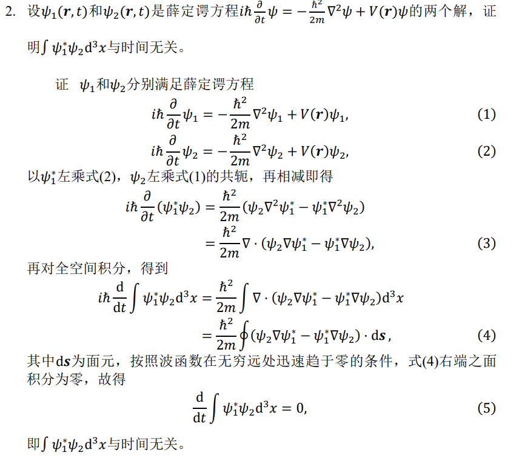
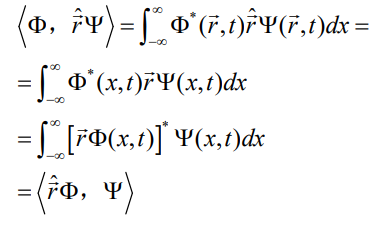
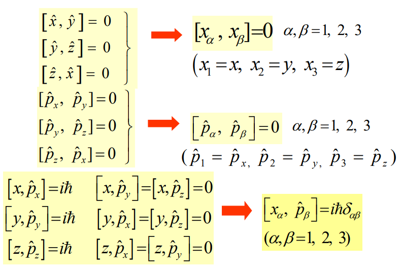

# 量子物理复习笔记

不考的内容：周期性，一维谐振子经典求解

重点考察的内容：薛定谔方程，本征值本征矢求解，哈密顿算符

## 数学基础

### 波函数空间

量子物理中单个粒子用$\Psi(\vec{r},t)$表示，波函数的模的平方（波的强度）代表时刻 t、在空间$\vec{r}$点处，单位体积元中微观粒子出现的概率。

波函数空间$F$上内积的定义：$(\phi, \psi) = \int d^3r\phi^*(r) \psi(r)$

波函数空间上内积的性质：

* $(\phi, \psi)=(\psi, \phi)^*$
* $(\phi, \lambda_1\psi_1+\lambda_2\psi_2)=\lambda_1(\phi,\psi_1)+\lambda_2(\phi, \psi_2)$
* $(\lambda_1\phi_1+\lambda_2\phi_2,\psi)=\lambda_1^*(\phi_1,\psi)+\lambda_2^*(\phi_2,\psi)$

内积对第二个是线性的，对第一个因子是反线性的。

### 离散正交基

* $(u_i, u_j)=\delta_{ij}$
* F中任意波函数都可以由$u_i(\vec{r})$唯一的展开。$\Psi(\vec{r})=\sum_ic_iu_i(\vec{r})$。$c_i$称为波函数在$u_i$上的分量。$c_i=(u_i,\Psi)$

基矢完备性（封闭性）条件：

$$
\sum_iu_i^*(\vec{r'})u_i(\vec{r})=\delta(\vec{r}-\vec{r'})
$$

正交归一性条件：

$$
(u_i, u_j)=\delta_{ij}
$$

### 连续正交基

连续，不属于$L_2$空间，但波函数依然可以在其上展开，同样满足正交归一性和完备性。

### 左矢和右矢

#### 右矢：态空间中的元素

一个量子态可以用一个态矢量表示，每个波函数可与态矢量一一对应。

$$
\Psi(\vec{r})\in F \Leftrightarrow \ket{\Psi} \in E
$$

态空间内积$(\ket{\Psi}, \ket{\phi})=\langle\Psi|\phi\rangle$为一个复数。

#### 左矢：态空间对偶空间中的元素

* 每一个右矢都对应于一个左矢，但并非每一个左矢都对应于一个右矢。
* $\ket{\lambda\phi}=\lambda\ket{\phi}$, $\bra{\lambda \phi} = \lambda^*\bra{\phi}$

### 线性算符

线性算符A使每一个右矢$\ket{\psi}$都有一个对应的右矢$\ket{\psi'}$，  
且这种对应关系是线性的：

$$
\ket{\psi'}=A\ket{\psi}
$$

$$
A(\lambda_1\ket{\psi_1}+\lambda_2\ket{\psi_2})=\lambda_1A\ket{\psi_1}+\lambda_2A\ket{\psi_2}
$$

#### 对易子算符

$$
[A,B]=AB-BA
$$

一些恒等式：

$$
\begin{aligned}
&[A,B]=-[B,A] \\
&[A,B+C]=[A,B]+[A,C] \\
&[A+B,C]=[A,C]+[B,C] \\
&[A,BC]=[A,B]C+B[A,C] \\
&[AB,C]=[A,C]B+A[B,C]
\end{aligned}
$$

$[A,B]=0$ 称为满足对易关系

#### 矩阵元

$\bra{\phi}A\ket{\psi}$ 是一个数

#### 投影算符

$$
P_\psi = \ket{\psi}\bra{\psi}
$$

其中$\psi$满足$\bra{\psi}\ket{\psi}=1$

将其作用于任一右矢，即得到与$\ket{\psi}$成正比的右矢。

性质：$P_\psi^n=P_\psi$

### 厄米共轭

#### 伴随算符

A的伴随算符为$A^\dagger$  

$$
\bra{\psi}A^\dagger\ket{\phi}=\bra{\phi}A\ket{\psi}^*
$$

$$
(\phi, A\psi) = (A^\dagger\phi, \psi)
$$

$$
(AB)^\dagger = B^\dagger A^\dagger
$$

#### 运算规则

* 将常数换成其共轭复数
* 将右矢换成其对应的左矢
* 将左矢换成其对应的右矢
* 将算符换成其伴随算符
* 即颠倒各因子的顺序（但常数的位置无关紧要）

$$
(\lambda\bra{u}A\ket{v})^\dagger = \lambda^*\bra{v}A^\dagger\ket{u}
$$

#### 厄米算符

$$
A=A^\dagger
$$

$$
\bra{\psi}A\ket{\phi}=\bra{\phi}A\ket{\psi}^*
$$

$$
\lambda\langle\psi|\psi\rangle= \bra{\psi}A\ket{\psi} = \bra{\psi}A^\dagger \ket{\psi} = (\bra{\psi}A\ket{\psi} )^\dagger = \lambda^*\langle\psi|\psi\rangle
$$

厄米算符的本征值是实数

### 基矢

一组正交归一基必须满足归一性与完备性。

* $\langle u_i | u_j \rangle = \delta_{ij}$
* $\sum \ket{u_i}\bra{u_i} = I$

在这组基下，右矢可以表示为列向量，左矢可以表示为行向量，算符可以表示为矩阵。

如果要转换基，例如从$\{u\}$转化到$\{s\}$。定义变换矩阵$S$，$S_{ik} = \langle u_i | s_k \rangle$  

$$
\langle t_k | \psi \rangle = \sum \langle t_k | u_i \rangle \langle u_i | \psi \rangle = \sum S_{ki}^\dagger\langle u_k | \psi \rangle
$$

$$
\langle \psi| t_k \rangle = \sum \langle \psi | u_i \rangle \langle u_i | t_k \rangle = \sum \langle \psi | u_i \rangle S_{ik}
$$

## 薛定谔方程

$$
i\hbar\frac{\partial \Psi(\vec{r},t)}{\partial t} = \left[ -\frac{\hbar^2}{2m}\nabla^2+U(\vec{r},t)\right]\Psi(\vec{r},t)
$$

若势能U与时间无关，则可得到定态薛定谔方程。

$$
 \left[ -\frac{\hbar^2}{2m}\nabla^2+U(\vec{r})\right]\psi(\vec{r})=E\psi(\vec{r})
$$

引入哈密顿算符

$$
\hat{H} = \left[ -\frac{\hbar^2}{2m}\nabla^2+U(\vec{r})\right]
$$

定态薛定谔方程变为

$$
\hat{H}\psi(\vec{r})=E\psi(\vec{r})
$$

$\psi(\vec{r})$为本征函数，E为本征值。本征函数构成正交归一集。

能量平均值$\langle H \rangle = E$。

含时波函数

$$
\Psi(\vec{r},t)=T(t)\psi(\vec{r})=e^{\frac{iEt}{\hbar}}\psi(\vec{r})
$$

概率密度

$$
\rho = |\Psi|^2
$$

概率流

$$
\vec{J}=\frac{\hbar}{2mi}[\Psi^*\nabla\Psi-\Psi\nabla\Psi^*]
$$

**补充：关于$\nabla$算子**  
Nabla算子可以用来表示一个矢量场的通量。  
定义$\nabla=\frac{\partial}{\partial x}\vec{i} + \frac{\partial}{\partial y}\vec{j} + \frac{\partial}{\partial z}\vec{k}$，则一个矢量场$F$，$\frac{\partial F_x}{\partial x}+\frac{\partial F_y}{\partial y}+\frac{\partial F_z}{\partial z} = \nabla \cdot F $  
高斯公式可以写作$\int_V \nabla F dv = \int_S F ds$  
斯托克斯公式可以写作$\int_S \nabla \times F ds = \int_C F \cdot dl$

**例题**  
  
其中(4)就用到了高斯公式。(5)之所以等于0是因为粒子在无穷远处的概率极小，其概率流密度趋于零，故在无穷远处面积分为0。

## 定态问题

### 一维无限深势阱

$$
\left\{ \begin{aligned}&-\frac{\hbar^2}{2m}\frac{d^2}{dx^2}\psi(x)=E\psi(x)\quad 0<x<a \\
&\psi(x=0) = \psi(x=a) = 0
\end{aligned}
\right.

$$

方程的通解为$\psi=C_1e^{r_1x}+C_2e^{r_2x}$  

由1式的特征方程得$r_1=i\sqrt{\frac{2mE}{\hbar^2}}$，$r_2=-i\sqrt{\frac{2mE}{\hbar^2}}$  
 

由2式可得$C_1=-C_2$，$E_n=\frac{n^2\hbar^2\pi^2}{2ma^2}$。

再由归一化条件得到$C_1=-C_2=\sqrt{\frac{1}{2a}}$，于是

$$
\psi_n(x)=\left\{\begin{aligned}&\sqrt{\frac{2}{a}}\sin\frac{n\pi}{a}x \quad 0\leq x \leq a\\
&0\quad0>x,x>a
\end{aligned} \right.
$$

### 一维谐振子

$$
\hat{H} = -\frac{\hbar^2}{2m}\frac{d^2}{dx^2}+\frac{1}{2}m\omega^2x^2
$$

$$
E_n=(n+\frac{1}{2})\hbar\omega\qquad n=0,1,2\cdots
$$

## 自由粒子波函数与波包

### 一维自由粒子

$$
-\frac{\hbar^2}{2m}\frac{d^2}{dx^2}\psi(x)=E\psi(x)
$$

定义$k=\sqrt{\frac{2mE}{\hbar^2}}$  

$$
\Psi_k(x,t)=Ae^{i(kx-\frac{\hbar k^2}{2m}t)}
$$

自由空间中运动的粒子无确定能量

对于一般定态问题，可以利用$\Psi(\vec{r},t=0)$的初始条件

$$
\Psi(x,0)=\frac{1}{\sqrt{2\pi}}\int_{-\infty}^{\infty}\phi(k)e^{ikx}dk
$$

对波函数进行傅里叶变换

$$
\phi(k)=\frac{1}{\sqrt{2\pi}}\int_{-\infty}^{\infty}\Psi(x,0)e^{-ikx}dx
$$

$$
\Psi(x,t)=\frac{1}{\sqrt{2\pi}}\int_{-\infty}^{\infty}\phi(k)e^{i(kx-\omega t)}dk \qquad \omega=\frac{\hbar k^2}{2m}
$$

相速度$v_k=\frac{\omega}{k}=\frac{\hbar k}{2m}$，群速度$v_g=2v_k=\frac{\hbar k}{m}$  

### 高斯波包

设一维高斯波包

$$
\phi(p)=Ae^{-(p-p_0)^2d^2/\hbar^2}
$$

这里$p=\hbar k$。$v=\frac{p_0}{m}$, $\Delta=\frac{\hbar}{2md^2}t$  

* 波包最大值以群速度$v$移动
* 宽度$\Delta$随时间增大
* 平均坐标$\langle x \rangle = vt$
* 位置坐标方差

  $$
  \delta_x^2 = \int dx |\Psi(x,t)|^2(x-vt)^2=d^2(1+\Delta^2)
  $$

## 位置、动量算符

如果用动量p为自变量表示波函数$C(p,t)$，就可以得到

$$
\Psi(x,t) = \frac{1}{\sqrt{2\pi\hbar}}\int C(p,t)e^{\frac{i}{\hbar}px}dp
$$

$$
C(p,t) = \frac{1}{\sqrt{2\pi\hbar}}\int \Psi(x,t)e^{-\frac{i}{\hbar}px}dx
$$

拓展到三维空间

$$
\Psi(\vec{r},t) = \frac{1}{(2\pi\hbar)^{3/2}}\int C(p,t)e^{\frac{i}{\hbar}\vec{p}\cdot\vec{r}}d^3\vec{p}
$$

$$
C(\vec{p},t) = \frac{1}{(2\pi\hbar)^{3/2}}\int \Psi(\vec{r},t)e^{-\frac{i}{\hbar}\vec{p}\cdot\vec{r}}d^3\vec{r}
$$

定义位置算符$\hat{\vec{r}}\Psi=\vec{r}\Psi$，位置算符函数$F(\hat{x},\hat{y},\hat{z})\Psi=F(x,y,z)\Psi$  

**证明：位置算符是厄米算符**  
$(\phi, A\psi) = (A^\dagger\phi, \psi)$，这是所有算符都满足的性质。  
  
则$\langle \hat{\vec{r}}\Phi, \Psi \rangle = \langle \hat{\vec{r}}^\dagger \Phi, \Psi \rangle$，所以$\hat{\vec{r}}=\hat{\vec{r}}^\dagger$

动量算符

$$
\hat{p_x}=\frac{\hbar}{i}\frac{d}{dx}
$$

它同样也是厄米算符

动量算符与位置算符的对易关系:

### 应用：一维谐振子与升降算符

哈密顿算符

$$
\hat{H} = -\frac{\hbar^2}{2m}\frac{d^2}{dx^2}+\frac{1}{2}m\omega^2x^2 = \frac{1}{2m}[\hat{p}^2+(m\omega\hat{x})^2]
$$

引入升降算符

$$
\hat{a}_+ = \frac{1}{\sqrt{2m\hbar\omega}}(-i\hat{p}+m\omega \hat{x})
$$

$$
\hat{a}_- = \frac{1}{\sqrt{2m\hbar\omega}}(i\hat{p}+m\omega \hat{x})
$$

$$
\hat{H}=\hbar\omega(\hat{a}_+\hat{a}_-+\frac{1}{2})
$$

* $(\hat{a}_+)^\dagger = \hat{a}_-$
* $\langle \psi, \hat{a}_+\hat{a}_-\psi \rangle\geq0$
* $[\hat{a}_+,\hat{a}_-]=-1$
* $[\hat{a}_+,\hat{a}_+\hat{a}_-]=-\hat{a}_+$
* $[\hat{a}_-,\hat{a}_+\hat{a}_-]=\hat{a}_-$

定义算符$\hat{N}=\hat{a}_+\hat{a}_-$  

$$
\hat{N}\psi_n=n\psi_n
$$

$$
\hat{N}(\hat{a}_-\Psi_n)=(n-1)(\hat{a}_-\Psi_n)
$$

$$
\hat{N}(\hat{a}_+\Psi_n)=(n+1)(\hat{a}_+\Psi_n)
$$

作用到本征函数上后本征值加减1，故称为升降算符。

$$
\hat{a}_-\psi_n = \sqrt{n}\psi_{n-1}
$$

$$
\hat{a}_+ \psi_n=\sqrt{n+1}\psi_{n+1}
$$

递推关系可知

$$
\psi_n = \frac{1}{\sqrt{n!}}(\hat{a}_+)^n\psi_0
$$

### 空间反演算符

$$
\hat{P}\psi(x) = \psi(-x)
$$

对一维谐振子

$$
\hat{P}\psi_n(x) = (-1)^n\psi_n(x)
$$
